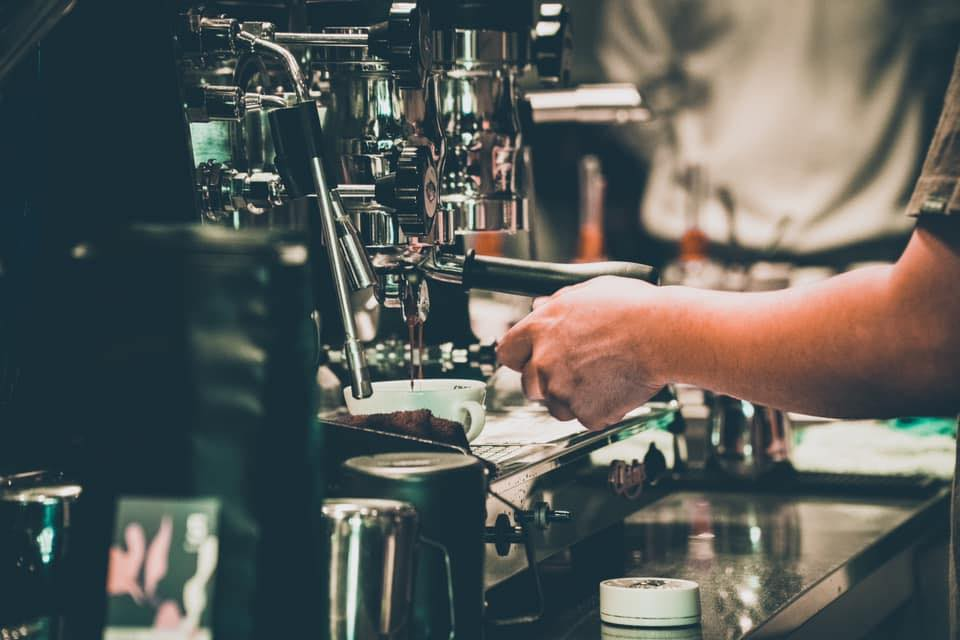

# NCU Coffee Club

Welcome to the NCU Coffee Club GitHub organization! ☕️

## About Us

NCU Coffee Club is a student-run organization at NCU (Your University Name) dedicated to bringing together coffee enthusiasts from all walks of life. Whether you're a seasoned coffee connoisseur or just starting to explore the world of coffee, our club provides a welcoming space to connect, learn, and share our passion for coffee.

## Membership

Membership in NCU Coffee Club is open to all students, faculty, and staff at NCU who have an interest in coffee. Joining our club is a great way to meet new people, learn about different coffee brewing techniques, and discover new flavors from around the world. Additionally, if you're interested in contributing to our programming department for handling technical aspects or projects related to coffee, you can [join our organization](#) on GitHub.

## Activities

### Coffee Tasting Sessions

We regularly host coffee tasting sessions where members can sample a variety of coffees sourced from different regions and roasters. These sessions provide an opportunity to explore the diverse flavors of coffee and learn about the origin, processing, and brewing methods.

### Brewing Workshops

Our brewing workshops cover a range of techniques, including pour-over, French press, AeroPress, and espresso. Led by experienced members or guest baristas, these hands-on workshops offer valuable insights and tips for brewing cafe-quality coffee at home or in the dorm.

### Coffee Study Sessions

Need a caffeine boost while studying for exams or working on assignments? Join us for coffee study sessions where we provide free coffee and a supportive study environment. It's a great way to fuel your productivity and connect with fellow students over a shared love for coffee.

## Open Projects

In addition to our regular activities, NCU Coffee Club is open to collaborating on projects related to coffee processes. Whether it's developing new brewing methods, exploring sustainable coffee farming practices, or creating innovative coffee-related technologies, we welcome ideas and initiatives from members and the wider community.

## Get Involved

We're always looking for enthusiastic members to help organize events, lead workshops, contribute to open projects, or propose new ideas for our club. If you're interested in getting involved or have suggestions for future activities, feel free to reach out to us on [Facebook](https://www.facebook.com/NCUcafeclub?locale=zh_TW) or [Instagram](https://www.instagram.com/ncu_coffee_official/).

## Connect With Us
<!-- - [Official Website](#) -->
- [Facebook](https://www.facebook.com/NCUcafeclub?locale=zh_TW)
- [Instagram](https://www.instagram.com/ncu_coffee_official/)

Join us as we embark on a journey to explore the world of coffee together, and let's make a difference in the coffee community! ☕️
